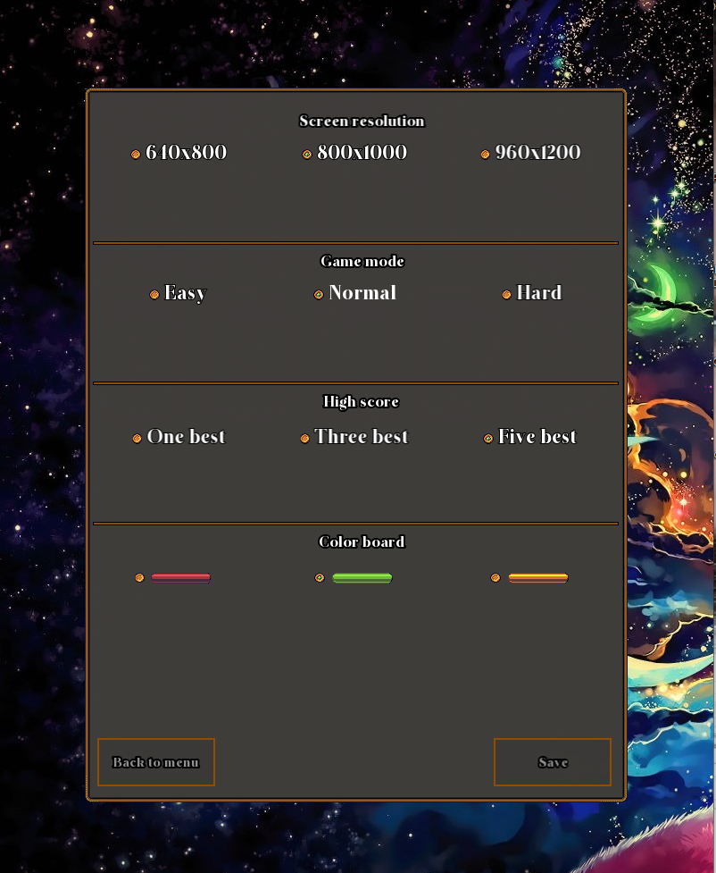
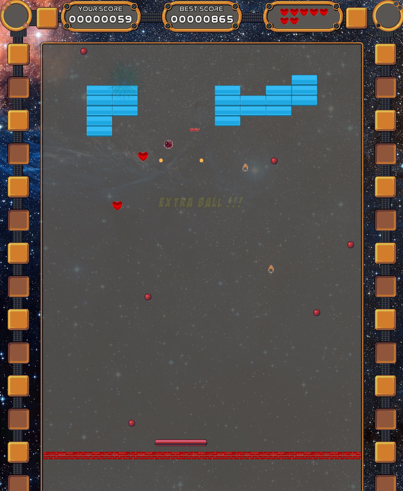
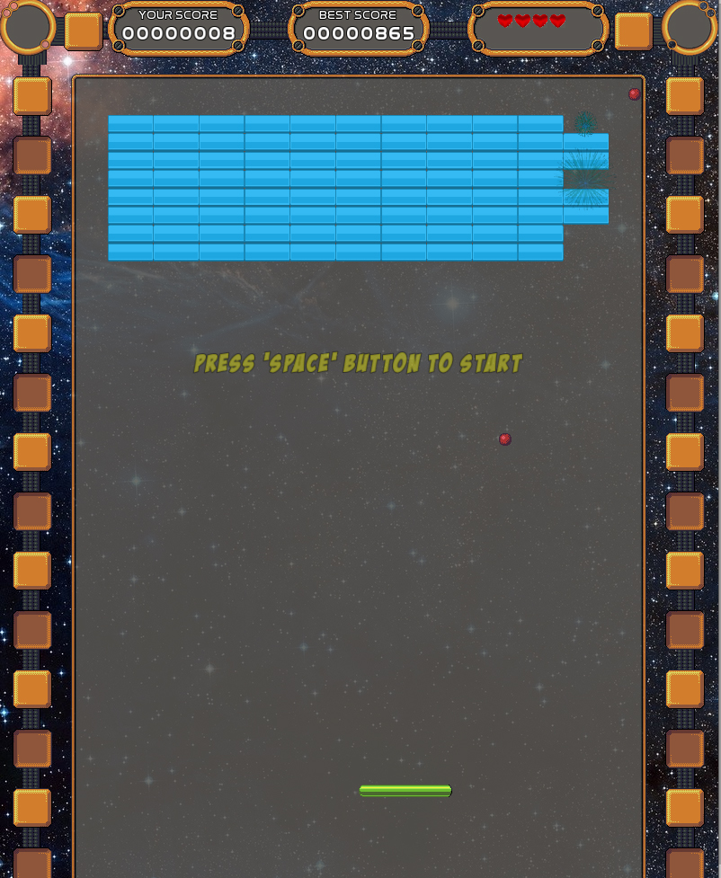
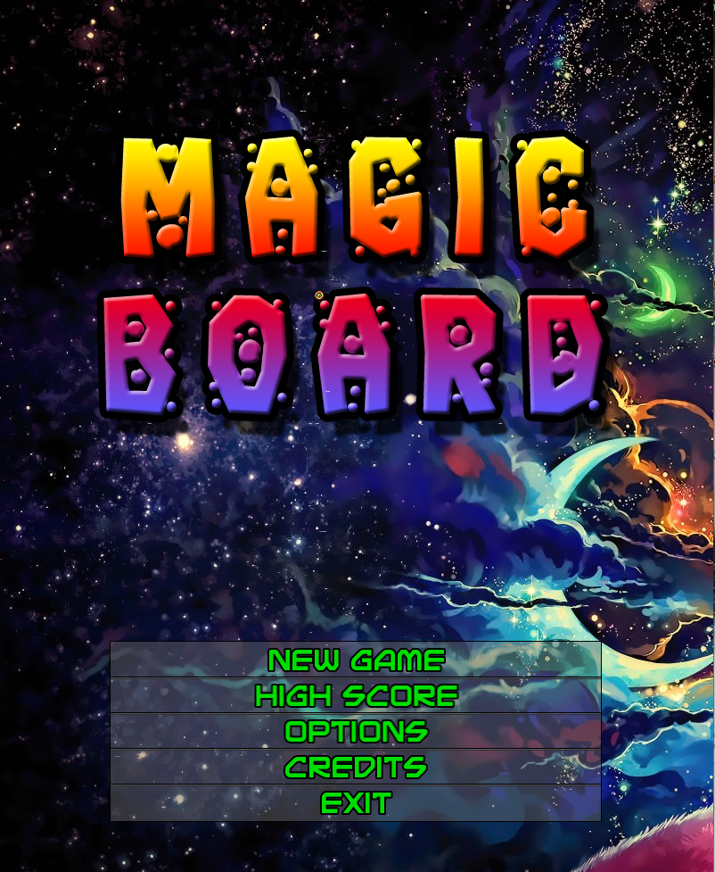

# **Magic_board**
 My second game project

## Table of contents
* [General info](#general-info)
* [Technologies](#technologies)
* [Setup](#setup)
* [Demo](#Demo)
* [Screenshot](#Screenshot)

## General info
This game is a simple project with almost 5000 line of code to show my practice and skills in C++
	
## Technologies
Project is created with:
* [C++ 11](https://en.cppreference.com/w/cpp/11)
* [SFML 2.5.1 Library](https://www.sfml-dev.org/documentation/2.5.1/)
* [IDE Code::Blocks](http://www.codeblocks.org/home)
* [Sound and texture library](https://opengameart.org/)
	
## Setup
You can download and instal my game from [MY WEBSITE](http://lukasz-kukulka.pl/?page_id=177)

## Demo 
[Watch the video in Youtube](https://youtu.be/gdISoUaq2zY)

## Screenshot

